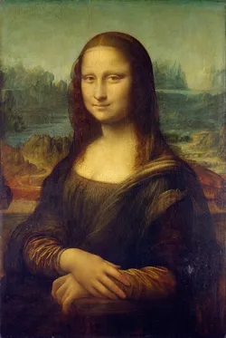

# Image-Pyramids-Blending

Laplacian pyramid is an algorithm using Gaussian to blend the image while keeping the significant feature in the mean time. It downsizes the image into different levels (sizes) with Gaussian. Later it expands the Gaussian in to the lower lever and subtracts from the image in that lever to acquire the Laplacian image. After generating Laplacian pyramids for the foregorund and background images, we combine the two images in different Laplacian levels by combining partial images from each of them.

## Steps:
1. Image Masking:
    - Align foreground and background images
    - GUI to create mask on the foreground image of following shapes:
        - ellipse
        - rectangle
        - free shape
2. Image blending
    - Blending is done by combining different Laplacian levels
  

## Results

foreground image           |  background image |  blended image
:-------------------------:|:-------------------------: |:-------------------------:
  |   | 